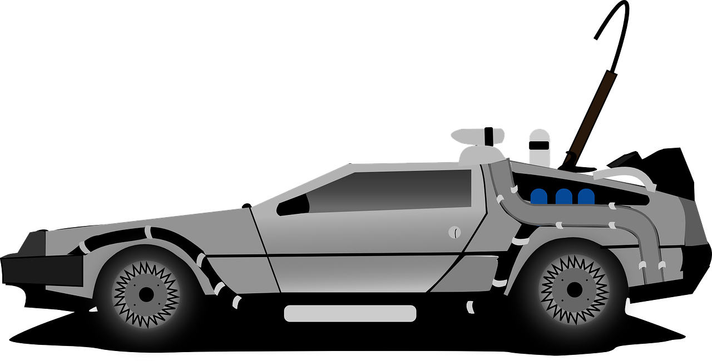

# deVoReaNN

A virtual reality environment for physically assembling deep learning models to solve data science problems.

## Getting Started

These instructions will get you a copy of the project up and running on your local machine for development and testing purposes. See deployment for notes on how to deploy the project on a live system.

### Prerequisites

Due to the resource-intensive nature of virtual reality, you should have a computer equipped with a high-end GPU. The project was designed for an Oculus Rift with related sensors.

You should also install [Unity](https://store.unity.com/download?ref=personal) on your development machine.

To run the backend, make sure you have [Docker](https://www.docker.com/get-started) installed.

### Installing

To install the frontend, clone this repository and open the UHACK subdirectory in Unity.

The backend comes packaged as a Docker Hub container: `docker pull aniskywalker/devoreann-backend`.

### Running the Tests

It was a 20 hour hackathon, you think there are tests!?

## Deployment

During the U-HackMed event, an instance of the backend was run on the BioHPC infrastructure within the UT Southwestern network. The specific steps to do so are specific to your package manager/container runtime.

The server will expose itself on port `:50051`.

The client can be deployed using the build script (WIP) or by building it directly from Unity.

## Built With

* Unity
* Tensorflow/Keras
* MNIST dataset
* gRPC/Protocol Buffers

## Contributing

Please read [CONTRIBUTING.md](CONTRIBUTING.md) for details on our code of conduct, and the process for submitting pull requests to us.

## Versioning

We (try to) use [SemVer](http://semver.org/) for versioning. For the versions available, see the tags on this repository.

## Authors

* **Murat Can Çobanoğlu**, Project Lead (UT Southwestern Distinguished Fellow)
* Kevin VanHorn, frontend (University of Texas at Dallas)
* Meyer Zinn, backend/networking (St. Mark's School of Texas)
* Michael D'Annunzio, frontend (University of Texas at Dallas)
* Siddharth Agarwal, backend/machine learning (University of Texas Arlington)
* Xiaoxian Jing, backend/machine learning (Southern Methodist University)

## License

This project is licensed under the MIT license - see the [LICENSE](LICENSE) file for details.

## Acknowledgments

* Special thanks to the UT Southwestern Bioinformatics department for their incredible hospitality. This project would not be possible without their initiative.